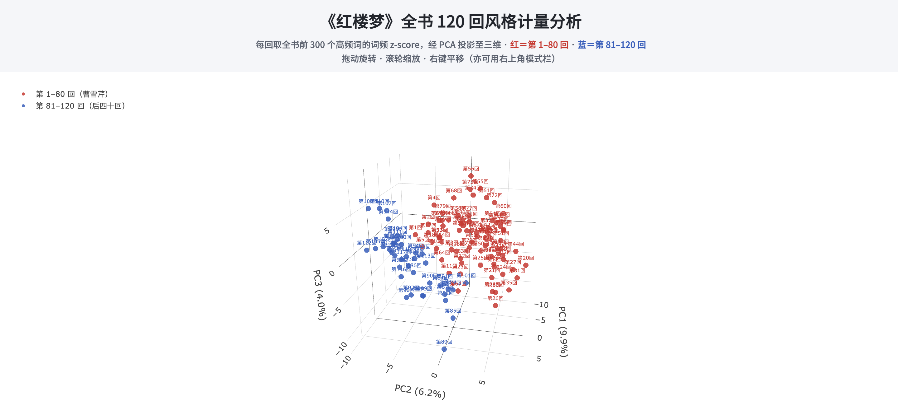

<p class="updated">Last updated: Sep 3, 2026</p>
<p><a href="../../">CHI 3242 Course Syllabus</a></p>
<h1>Week 1 · Introduction</h1>

<h2>1. Create a repository and start a Codespace</h2>
<ol>
<li>Create a <a href="https://github.com/">GitHub</a> account.</li>
<li>Go to the template repository <a href="https://github.com/mcjkurz/qh-starter">https://github.com/mcjkurz/qh-starter</a>, click <strong>Use this template</strong>, and create your own repository (do not edit the template itself).</li>
<li>Open your new repository, then click <strong>Code → Codespaces → Create codespace</strong>. The first start may take a few minutes while packages install.</li>
</ol>

<h2>2. Connect OpenCode</h2>
<p>The instructor will give you an OpenRouter API key. Do not put the key in your repository, and do not share it.</p>
<ol>
<li>In the Codespace terminal, type <code>opencode</code> and press Enter.</li>
<li>Type <code>/connect</code> and press Enter.</li>
<li>Search for and select <strong>OpenRouter</strong>.</li>
<li>Paste the API key when asked.</li>
<li>Type <code>/models</code> and press Enter.</li>
<li>Select <strong>GLM-5.3-Flash</strong>.</li>
</ol>

<h2>3. In-class exercise</h2>
<p>Copy the following prompt and paste it into OpenCode:</p>
<div class="prompt">
<p class="prompt-label">Prompt 1</p>
<pre>The 红楼梦 novel is already in this folder as a .txt file.
jieba, qhchina, numpy, matplotlib, and scikit-learn are already installed; do not create a virtual environment or reinstall packages.

In the root folder, create a Python script (.py) that:
- loads that file and splits it into 120 chapters (each chapter starts with 第 and a Chinese numeral, e.g. 第一回, 第八十五回, 第一一八回)
- tokenizes each chapter with jieba
- finds the 300 most common words in the novel
- calculates a z-score for each of those word frequencies in each chapter
- projects the chapter vectors into 3D with PCA
- colors chapters 1–80 red and 81–120 blue
- imports qhchina and calls load_fonts()
- saves a .png</pre>
</div>

<p>When it finishes, check the result by opening the <code>.png</code> file in the file list on the left.</p>
<p>If it looks right, paste this second prompt into OpenCode:</p>
<div class="prompt">
<p class="prompt-label">Prompt 2</p>
<pre>Create an HTML page that lets me rotate and move that 3D PCA projection.
The page should also show the top 20 positive features and the top 20 negative features
for the first 80 chapters and for the last 40 chapters.</pre>
</div>

<p>Codespace usually cannot open this HTML file. Right-click the file on the left, choose <strong>Download</strong>, save it to your computer, and open it in a browser. If everything worked, you should see a rotatable 3D projection and the positive and negative feature words for the first 80 and last 40 chapters. You can also open this <a href="hongloumeng_3d.html">interactive example</a>.</p>

<h2>4. Save to GitHub</h2>
<p>Commit and push so your work is not lost when the Codespace shuts down. Two steps:</p>
<ol>
<li><strong>Commit:</strong> click Source Control on the left (the branch icon), write a short message (for example, “Week 1 exercise”), then click <strong>Commit</strong>. Or in the terminal:</li>
</ol>

```
git add -A
git commit -m "Week 1 exercise"
```

<ol start="2">
<li><strong>Push:</strong> in the same sidebar, click <strong>Sync Changes</strong> or <strong>Push</strong>. Or in the terminal:</li>
</ol>

```
git push
```

<figure class="example">

<figcaption>Example of the expected result</figcaption>
</figure>
<figure class="example">

<figcaption>Example of the expected result</figcaption>
</figure>
