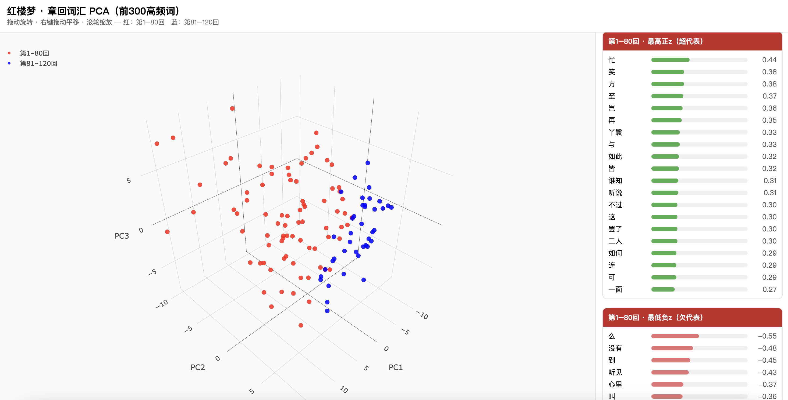

<p class="updated">最後更新：2026年9月2日</p>
<p><a href="../../">CHI 559 課程大綱</a></p>
<h1>第1週　導論</h1>

<h2>1. 建立倉庫並啟動 Codespace</h2>
<ol>
<li>註冊 <a href="https://github.com/">GitHub</a> 帳號。</li>
<li>請到 <a href="https://keyreg.qhchina.org">keyreg.qhchina.org</a> 領取你的 API 金鑰。</li>
<li>前往模板倉庫 <a href="https://github.com/mcjkurz/qh-starter">https://github.com/mcjkurz/qh-starter</a>，按 <strong>Use this template</strong>，建立你自己的倉庫（不要直接在模板上改）。</li>
<li>進入你剛建立的倉庫，按 <strong>Code → Codespaces → Create codespace</strong>。首次啟動需數分鐘，以完成套件安裝。</li>
</ol>

<h2>2. 連接 OpenCode</h2>
<p>請使用你在註冊時取得的 API 金鑰。不要把金鑰寫進倉庫，也不要與他人分享。</p>
<ol>
<li>在 Codespace 終端機輸入 <code>opencode</code> 並按 Enter。</li>
<li>輸入 <code>/connect</code> 並按 Enter。</li>
<li>搜尋並選擇 <strong>OpenRouter</strong>。</li>
<li>按提示貼上你在註冊時取得的 API 金鑰。</li>
<li>輸入 <code>/models</code> 並按 Enter。</li>
<li>選擇 <strong>GLM-5.3-Flash</strong>。</li>
</ol>

<h2>3. 課堂練習</h2>
<p>將下列提示完整複製，貼進 OpenCode：</p>
<div class="prompt">
<p class="prompt-label">提示 1</p>
<pre>The 红楼梦 novel is already in this folder as a .txt file.
jieba, qhchina, numpy, matplotlib, and scikit-learn are already installed; do not create a virtual environment or reinstall packages.

In the root folder, create a Python script (.py) that:
- loads that file and splits it into 120 chapters (each chapter starts with 第 and a Chinese numeral), for example:

第一回  甄士隐梦幻识通灵　贾雨村风尘怀闺秀
第八十五回  贾存周报升郎中任　薛文起复惹放流刑
第一一八回  记微嫌舅兄欺弱女　惊谜语妻妾谏痴人
- tokenizes each chapter with jieba
- finds the 300 most common words in the novel
- calculates a z-score for each of those word frequencies in each chapter
- projects the chapter vectors into 3D with PCA
- colors chapters 1–80 red and 81–120 blue
- imports qhchina and calls load_fonts()
- saves a .png</pre>
</div>

<p>完成後，檢查結果：在左側檔案列表中點開 <code>.png</code> 檔。</p>
<p>確認無誤後，再把下列提示貼進 OpenCode：</p>
<div class="prompt">
<p class="prompt-label">提示 2</p>
<pre>Create an HTML page that lets me rotate and move that 3D PCA projection.
The page should also show the top 20 positive features and the top 20 negative features
for the first 80 chapters and for the last 40 chapters.</pre>
</div>

<p>完成後，Codespace 裡多半打不開這個 HTML。在左側檔案上按右鍵，選 <strong>Download</strong>，下載到自己的電腦，再用瀏覽器打開。若一切順利，你應看到類似下面的結果：可旋轉的三維投影，以及前八十回與後四十回的正負特徵詞。也可以直接打開這個<a href="hongloumeng_3d.html">互動示例</a>。</p>

<h2>4. 儲存到 GitHub</h2>
<p>請把結果存回你的倉庫，否則關閉 Codespace 後可能丟失。兩步即可：</p>
<ol>
<li><strong>提交（commit）：</strong>點左側的 Source Control（分支圖示），寫一句說明（例如「第1週練習」），再按 <strong>Commit</strong>。或在終端機執行：</li>
</ol>

```
git add -A
git commit -m "第1週練習"
```

<ol start="2">
<li><strong>推送（push）：</strong>同一側欄再按 <strong>Sync Changes</strong> 或 <strong>Push</strong>。或在終端機執行：</li>
</ol>

```
git push
```

<figure class="example">

<figcaption>預期結果示例</figcaption>
</figure>
<figure class="example">

<figcaption>預期結果示例</figcaption>
</figure>
